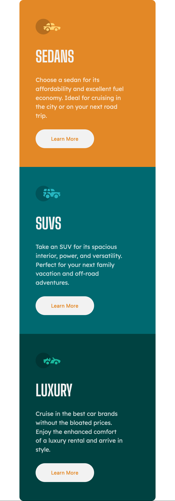

# Challenge 7, Frontend Mentor - 3-column preview card component solution

This is a solution to the [3-column preview card component challenge on Frontend Mentor](https://www.frontendmentor.io/challenges/3column-preview-card-component-pH92eAR2-). Frontend Mentor challenges help you improve your coding skills by building realistic projects.

## Table of contents

- [Overview](#overview)
  - [The challenge](#the-challenge)
  - [Screenshot](#screenshot)
  - [Links](#links)
  - [Built with](#built-with)
  - [What I learned](#what-i-learned)
  - [Continued development](#continued-development)
- [Author](#author)

## Overview

3-column preview card component challenge by Frontend Mentor, Coded by Abhishek Baliyan.

### The challenge

Users should be able to:

- View the optimal layout depending on their device's screen size
- See hover states for interactive elements

### Screenshot

### Links

- Solution URL: [Solution](https://github.com/abhishek-baliyan-dev/Frontend-mentor-challenge-3-column-preview-card-component/)
- Live Site URL: [Live](https://abhishek-baliyan-dev.github.io/Frontend-mentor-challenge-3-column-preview-card-component/)

### Built with

- Semantic HTML5 markup
- CSS custom properties
- Flexbox
- CSS Grid
- Mobile-first workflow

### What I learned

While i was trying to match the design and code, I learned width adjusting.

### Continued development

I want to learn more about the min width for responsiveness.

## Author

- Website - [Abhishek Baliyan](https://www.abhishekbaliyan.com) - Coming soon
- Frontend Mentor - [@abhishek-baliyan-dev](https://www.frontendmentor.io/profile/abhishek-baliyan-dev)
- Twitter - [@Abhi___baliyan](https://twitter.com/Abhi___baliyan)
